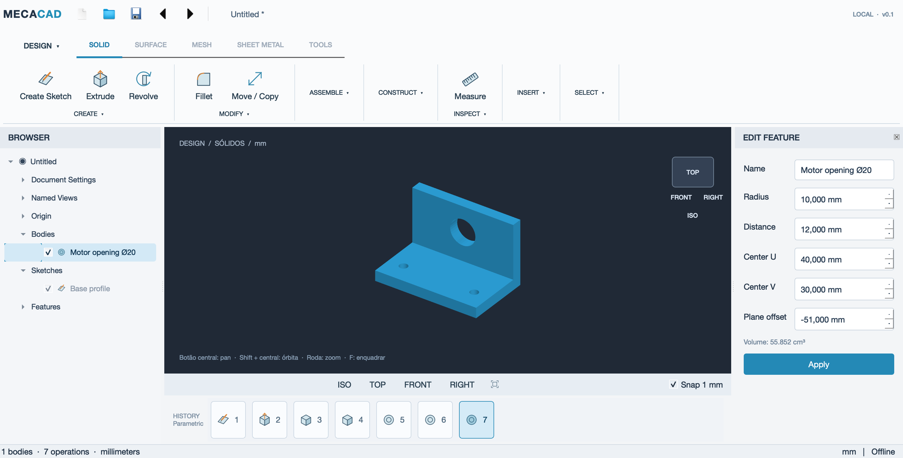

# MecaCAD 0.2

CAD desktop para peças mecatrônicas simples. Implementação independente em C++20,
Qt Widgets 6 e Open CASCADE 7.9. A versão inicial executa modelagem real e foi
desenvolvida e testada em macOS 14, Apple Silicon.



## Abrir

Abra `dist/MecaCAD-0.2.15.app`. O pacote local reúne o executável e suas bibliotecas.
O código-fonte não depende da pasta `dist`, que é gerada e ignorada pelo Git.

Para começar: **File → Open example — mounting bracket**. Também existem os
arquivos `examples/Mounting-bracket.mcad`, `.step`, `.stl` e `Base-profile.dxf`.

Leia o [guia de uso](docs/GUIA.md) e o [estado da entrega](docs/ENTREGA-0.2.md).

## Novidades de interação

Na 0.2.15, abrir Extrude com uma operação de extrusão selecionada edita essa
operação, em vez de criar um corpo duplicado. O mesmo vale para Revolve.
Sem um sketch ou operação correspondente selecionada, o comando aguarda a escolha
de um perfil e não reutiliza automaticamente o primeiro sketch. Selecionar um
sketch explicitamente continua permitindo criar uma nova operação.

Na 0.2.14, Move / Copy permite arrastar o objeto selecionado ou o centro das
hastes no plano da tela; as setas restringem a um eixo X, Y ou Z. A prévia acompanha
o arraste contínuo. Enter confirma uma operação e Esc descarta a prévia.
Mover/copiar também funciona em malhas STL; elas continuam sendo malhas, sem
conversão em sólido CAD. A velocidade da prévia depende da complexidade do modelo.

Na 0.2.13, File → Import STEP / STL e Insert aceitam STL binário e ASCII.
File → Open também abre STL em um novo documento. A malha é incorporada ao `.mcad`,
sem depender do arquivo original, e pode ser reexportada em STL. Coordenadas são
interpretadas em mm (STL não contém unidades). Limite: 50 MB e 1 milhão de triângulos.
Importação não converte malhas em sólidos paramétricos: operações de sólidos e
exportação STEP de malhas ainda não estão disponíveis.

Na 0.2.12, Sketch → Create → Polygon cria polígonos regulares de 3 a 64 lados.
Escolha a quantidade, clique no centro e em um vértice (ou pressione e arraste).
O mouse define raio e rotação com prévia; ↑/↓ muda os lados antes de confirmar e
Esc cancela. O resultado é uma polilinha fechada, pronta para extrusão e exportação;
não mantém uma restrição paramétrica de regularidade após editar seus vértices.

Na 0.2.11, XZ compartilha a borda frontal do XY no seletor de planos, seguindo
a referência visual do Fusion. Os três planos partem da origem no octante positivo;
os rótulos têm prioridade de clique sobre as faces transparentes sobrepostas.

Na 0.2.10, o seletor de planos mostra XY na base, YZ à esquerda e XZ à direita,
como um canto aberto. Os planos geométricos e seus offsets permanecem inalterados.

Na 0.2.9, clique nas cotas do sketch para editar largura/altura de retângulos e
diâmetro de círculos diretamente no desenho. Enter confirma, Esc cancela;
aceita vírgula ou ponto decimal. A alteração atualiza as operações dependentes e
pode ser desfeita. Duplo clique no perfil reabre seu sketch.

Na 0.2.8, o sketch tem encaixe inteligente em origem, extremidades, pontos médios,
centros de círculos/arcos e interseções de segmentos. Guias verdes ajudam no
alinhamento horizontal e vertical. A geometria tem prioridade sobre a grade;
o menu da grade permite desligar o encaixe. Não cria restrições persistentes.

Na 0.2.7, o seletor XY/XZ/YZ mostra três faces adjacentes de um cubo, sem
interseções no meio e com rótulos centrais. A origem e o offset dos planos não mudam.

Na 0.2.6, a prévia sólida da extrusão atualiza durante arraste contínuo, sem
esperar o mouse parar. O sólido cresce e diminui junto com a distância indicada.
Confirmar continua criando uma única operação; cancelar preserva o documento.

Na 0.2.5, segurar e arrastar o cubo orbita a câmera, inclusive durante sketch,
sem alterar seu plano geométrico. Cliques simples continuam escolhendo vistas.

Na 0.2.3, retângulos e círculos aceitam pressionar, arrastar e soltar, com prévia
durante o gesto. Dois cliques continuam disponíveis. Line também permite iniciar
o primeiro segmento por arraste; Enter conclui a cadeia. Esc cancela o gesto.

Na 0.2.2, faces, arestas e cantos do cubo são clicáveis e têm realce sob o mouse.
A câmera gira com transição suave de 300 ms; uma nova escolha redireciona o
movimento e a navegação manual o interrompe. Durante sketch, clicar em uma vista
retorna à orientação do plano de trabalho; arrastar permite inspecionar em 3D.

A correção 0.2.1 limpa a escolha de planos: sem texto de boas-vindas sobreposto,
sem grade/eixos atravessando a seleção, rótulos separados e realce sob o mouse.

- Interface escura compacta, Browser sobre o canvas, cubo clicável e histórico por ícones.
- Create Sketch: escolher o plano diretamente na área 3D, sem formulário inicial.
- Extrude: prévia e seta de distância arrastável; Enter confirma, Esc cancela.
- Move/Copy: translação por setas X/Y/Z, com valores exatos e rotação recolhidos por padrão.
- Selecionar não abre formulário. Duplo clique no histórico ou Edit Feature abre os parâmetros.
- Prévia não modifica o documento; confirmar cria uma operação, cancelar preserva o histórico.

## Implementado

- Barra de comandos organizada em Create, Modify, Assemble, Construct, Inspect,
  Insert e Select, com troca contextual para Sketch.
- Browser à esquerda, edição à direita e histórico embaixo.
- Visualização 3D com OpenGL, seleção de corpos e contornos de sketches, pan,
  órbita, zoom, vistas ortográficas, ajuste de enquadramento e trackpad.
- Sketch em XY, XZ ou YZ, com offset numérico; retângulo, círculo, polilinha e arco.
- Dimensões editáveis de retângulo/círculo e coordenadas editáveis de polilinhas.
- Extrusão e revolução de perfil fechado, novo corpo, união e corte.
- Caixa, cilindro, esfera, furos, booleanas, mover, copiar, rotacionar e filete
  aplicado a todas as arestas.
- Histórico com recálculo, desfazer/refazer, salvar/reabrir e recuperação periódica.
- Importação/exportação STEP, exportação STL e DXF dos sketches.
- Medidas da caixa envolvente e volume do sólido.

Os itens de menu identificados como **planned** estão desabilitados. A estrutura
familiar não significa equivalência total de interface ou funcionalidades ao Fusion.

## Limites atuais

A versão 0.2 tem um perfil por sketch. Retângulos e círculos têm parâmetros
dimensionais; ainda não há um solucionador geral de restrições, trim/extend,
sketch associado persistentemente a face, seleção individual de arestas para filete, montagens,
simulação, desenhos técnicos, CAM ou importação de arquivos nativos do Fusion.
O histórico pode ser editado, mas não reordenado ou percorrido com rollback.
STEP preserva geometria, não o histórico paramétrico do aplicativo de origem.
O recálculo é síncrono e a versão é indicada para modelos pequenos.
O clique em faces para iniciar sketch aceita apenas faces alinhadas a XY/XZ/YZ,
registrando seu plano e offset. Rotação, furos e filetes ainda usam campos numéricos;
não há anéis de rotação, arraste de vértices ou solucionador de restrições.

## Compilar no macOS

Dependências usadas: Qt 6.11.2 e Open CASCADE 7.9.3. O renderizador requer OpenGL 3.2.

```sh
brew install cmake qtbase opencascade
cmake -S . -B build -DCMAKE_BUILD_TYPE=Release \
  -DCMAKE_PREFIX_PATH="/opt/homebrew/opt/qtbase;/opt/homebrew/opt/opencascade"
cmake --build build -j 6
ctest --test-dir build --output-on-failure
open build/MecaCAD.app
```

Para gerar apenas o aplicativo `.app` com suas bibliotecas, sem ZIP: `sh scripts/package-macos.sh`.

O teste de interface requer uma sessão gráfica. A versão Windows ainda não foi
compilada nem validada; o CMake usa dependências Qt/Open CASCADE disponíveis em
outras plataformas, mas isso não substitui o teste nessas plataformas.

## Arquitetura

- `mecacore`: documento, operações paramétricas, núcleo geométrico e exportadores.
- `mecaui`: interface Qt Widgets e viewport OpenGL.
- `MecaCAD`: aplicativo desktop.
- `core_tests`: testes de geometria, arquivos e recálculo.
- `ui_tests`: fluxo de sketch → sólido por cliques na interface.
- `.mcad`: JSON versionado em milímetros; geometria importada é incorporada ao arquivo.

O histórico usa identificadores estáveis entre operações. Cada edição é validada
antes de entrar no histórico de desfazer. O salvamento nativo usa escrita atômica.
Qt Widgets foi adotado nesta etapa no lugar de QML para integrar diretamente os
controles desktop e o viewport, preservando a separação entre interface e modelo.

[Backlog](BACKLOG.md) · [Dependências](docs/DEPENDENCIAS.md)
